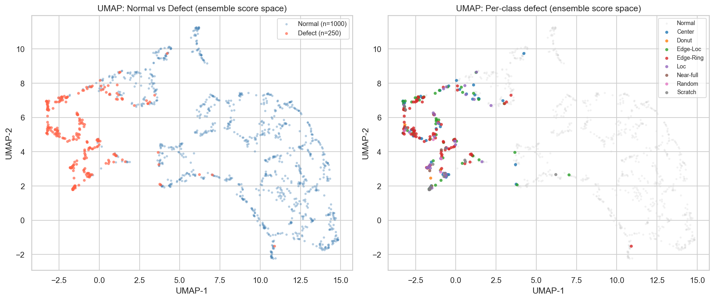
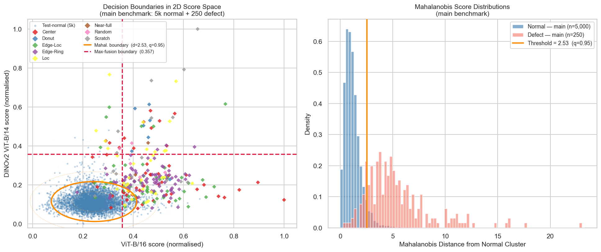

<!-- _class: lead -->

# Wafer Map Anomaly Detection on WM-811K

## From Reconstruction Baselines to Pretrained Local Feature Modelling

<br>

**50.039 Deep Learning · Y2026 · Group 08**

Henry Lee Jun (1004219) &nbsp;·&nbsp; Chia Tang (1007200) &nbsp;·&nbsp; Genson Low (1005931)

---

# The Problem

Semiconductor fabs generate hundreds of thousands of wafer maps. Most are normal. A few are not.

- **Defects are rare and costly:** each bad wafer drives up yield loss
- **Defect types are unpredictable:** 9 known patterns, but new ones can emerge
- **Labelled defect data is scarce:** 3.1% of the dataset is labelled defective; the rest is unlabelled
- **Classification does not scale:** you cannot enumerate every failure mode at training time

> **Goal:** Learn what a normal wafer looks like. Flag anything that deviates.

---

# The Dataset: WM-811K

**811,457 wafer maps** from the LSWMD dataset

| Split                | Count   | Share |
| -------------------- | ------- | ----- |
| Normal (labelled)    | 147,431 | 18.2% |
| Defective (labelled) | 25,118  | 3.1%  |
| Unlabelled           | 638,908 | 78.7% |

**Key challenge:** Class imbalance: a model predicting every wafer as normal achieves 96%+ accuracy while catching zero defects.

The 9 defect pattern types differ in shape, size, and sparsity, making detection non-trivial.

---

<!-- _class: figure -->

# Defect Type Gallery


---

# Defect Types: A Spatial Challenge

Eight distinct defect morphologies spanning very different spatial scales.

<!-- _style: "table { font-size: 0.72em; }" -->

| Defect type | Count (test) | Spatial character |
| ----------- | ------------ | ----------------- |
| **Edge-Ring** | 84 | Continuous ring of failures near the wafer perimeter |
| **Edge-Loc** | 53 | Localised cluster at or near the wafer edge |
| **Center** | 50 | Compact cluster at the wafer centre |
| **Loc** | 34 | Off-centre localised patch |
| **Scratch** | 15 | Thin elongated streak across the die grid |
| **Donut** | 7 | Curved partial ring inside the wafer body |
| **Random** | 5 | Scattered failures with no spatial coherence |
| **Near-full** | 2 | Defective region covering nearly the entire wafer |

> **Key insight:** Broad defects (Edge-Ring, Center) are detectable by any global method. Small, sparse defects (Scratch, Loc) require spatially precise, **patch-level** scoring.

---

# Our Plan: Normal-Only Training

We train **exclusively on normal wafer maps**. At inference, each wafer receives an anomaly score (higher means more deviant from normal).

**Why not supervised classification?**

- Requires balanced, labelled defect data: scarce in production
- Cannot detect defect types unseen at training time
- Anomaly detection generalises to new defect patterns automatically

**Training plan:**

- **Train:** normal wafers only
- **Validation:** normal wafers only (threshold calibration)
- **Test:** normal + all labelled defect types (held out completely)

---

# Benchmark Split & Threshold Protocol

All experiments share a **single fixed split** drawn from 50,000 labelled-normal wafers.

<div class="two-col">
<div>

**Data split**

| Subset | Normal | Defect |
|--------|--------|--------|
| Train  | 40,000 | 0 |
| Val    | 5,000  | 0 |
| Test   | 5,000  | 250 |

Defects are capped at **5% of test-normal count** to reflect realistic production prevalence.

</div>
<div>

**Threshold rule**

τ₀.₉₅ = 95th percentile of **validation-normal** anomaly scores only

- No defect labels used at any stage
- Exactly 5% of validation normals exceed τ₀.₉₅ by construction
- Bounding expected false-positive rate at ≈5%

> **Best-sweep F1** (threshold tuned on test labels) is reported as an upper bound only. It is never used as the deployment metric.

</div>
</div>

---

# How We Evaluate

Three metrics, because **accuracy alone is useless** for imbalanced data.

| Metric    | What it measures                        | Why it matters here                       |
| --------- | --------------------------------------- | ----------------------------------------- |
| **AUROC** | Ranking quality across all thresholds   | Threshold-free; strong ranking signal     |
| **AUPRC** | Precision-recall area under curve       | **Our primary metric** -- most informative at 5% prevalence |
| **F1**    | Harmonic mean at the deployed threshold | Reflects real production performance      |

A model predicting all wafers as normal achieves **96%+ accuracy** and **zero defect recall**. AUROC and AUPRC expose this immediately.

**Threshold:** 95th percentile of normal-only validation scores, no defect labels required.

---

# Method Journey

<!-- _style: "table { font-size: 0.72em; }" -->

Each method family was selected to address the limitations of its predecessor.

|        | Family                | Hypothesis                                 | Finding                                            |
| ------ | --------------------- | ------------------------------------------ | -------------------------------------------------- |
| **H1** | Reconstruction        | Can pixel reconstruction detect anomalies? | Pixel errors too diffuse; sparse defects invisible |
| **H2** | Global Features       | Do pretrained global features do better?   | Pooling collapses spatial structure                |
| **H3** | **PatchCore + CNN**   | **Do local patch features matter?**        | **Large jump: patch-level scoring is the key**     |
| **H4** | PatchCore + ViT       | Does backbone architecture matter?         | ViT-B/16 at 224×224 wins                           |
| **H5** | PatchCore + ViT (MAE) | Does domain adaptation improve features?   | AUPRC improves; F1 stays stable                    |
| **H6** | **Ensemble**          | **Can diverse pretraining push further?**  | **Best overall: AUROC 0.967**                      |

---

# Phase 1: Reconstruction Baselines

The autoencoder compresses normal wafers into a 128-dim bottleneck. Anomalies produce elevated reconstruction error.

<div class="two-col">
<div>

**Architecture**
- Encoder: 3× strided Conv2d (16→32→64 ch, stride=2) → flatten → 128-dim latent
- Decoder: symmetric transposed convolutions → sigmoid output
- 99.6% compression (4096 pixels → 128 values)

**Variants tested (11 AE runs + VAE + SVDD)**
- BatchNorm, Dropout sweep {0.00, 0.05, 0.10, 0.20}
- Residual skip connections
- Resolutions: 64×64, 128×128, 224×224
- VAE (β ∈ {0.001, 0.005, 0.01, 0.05}) and Deep SVDD

</div>
<div>

**Key Phase 1 results**

| Variant | F1 | AUROC | AUPRC |
|---|---|---|---|
| AE 224×224 (topk) | **0.510** | **0.901** | **0.596** |
| AE+BN 64×64 (max_abs) | 0.502 | 0.834 | 0.568 |
| AE baseline 64×64 | 0.468 | 0.839 | 0.522 |
| VAE (β=0.005) | 0.340 | 0.772 | 0.372 |
| Deep SVDD | 0.360 | 0.788 | 0.213 |

> **Resolution beats architecture:** 224×224 plain AE (F1=0.510) outperforms all 64×64 variants including BatchNorm, dropout, and residual AEs.

</div>
</div>

---

# Phase 1: The Score Ablation Insight

**The scoring rule matters almost as much as the model.** Seven reduction rules tested on the same fixed AE checkpoint:

<!-- _style: "table { font-size: 0.74em; }" -->

| Scoring Rule | Definition | F1 |
|---|---|---|
| **topk_abs_mean** | Average top 20% of pixel errors (sorted by magnitude) | **0.468** |
| mse_mean | Average squared pixel errors across entire image | 0.410 |
| max_abs | Single worst (maximum absolute) pixel error | 0.324 |
| foreground_mse | Average error in foreground-masked region | 0.317 |
| mae_mean | Average absolute pixel errors | 0.300 |
| pooled_mae_mean | MAE with spatial pooling | 0.293 |
| foreground_mae | MAE in foreground region | 0.239 |

**topk_abs_mean wins by +0.057 F1 over mse_mean.** Selecting high-error pixels outperforms averaging all pixels.

> The BatchNorm AE rescored with max_abs improved from F1=0.431 → **0.502 without any retraining**. Score design is a first-class decision co-equal with model architecture.

---

# Phase 1: The Global-Averaging Bottleneck

Why reconstruction fails on small defects: a simple arithmetic argument.

**A 50-pixel Scratch defect in a 4096-pixel image:**

```
wafer score = (50 high-error pixels + 3946 low-error pixels) / 4096  ≈  weak signal
```

The defect is **arithmetically diluted** even though local error is clearly elevated.

<div class="two-col" style="margin-top: 12px;">
<div>

**Per-defect recall (baseline AE)**

| Defect | Recall |
|--------|--------|
| Edge-Ring | **0.810** |
| Center | **0.720** |
| Loc | 0.206 |
| Scratch | 0.200 |

Large defects survive averaging; small ones drown.

</div>
<div>

**Phase 1 ceiling: AUPRC=0.596, F1=0.510**

Any improvement beyond this must fundamentally change how anomaly signals are aggregated: from global, full-image average to **local, patch-level scores**.

> Resolution helps (224×224 > 64×64), but the Scratch/Loc problem remains. Native-resolution autoencoders still score globally. Small defects still drown.

</div>
</div>

---

# Phase 2: Pretrained Features (Negative Control)

Can richer ImageNet features solve the problem without local scoring?

**Setup:** Frozen ResNet18 and WideResNet50-2. Score = L2 distance from each test wafer's global embedding to the centroid of train-normal embeddings. No training required.

<div class="two-col">
<div>

| Backbone | F1 | AUROC | AUPRC |
|---|---|---|---|
| WideResNet50-2 | 0.243 | 0.677 | 0.142 |
| ResNet18 | 0.236 | 0.685 | 0.195 |
| *(AE baseline, for ref)* | *0.468* | *0.839* | *0.522* |

Both baselines fall **below every reconstruction model** despite far richer features (512-dim vs 2048-dim).

</div>
<div>

**Why capacity does not help**

Spatial mean-pooling collapses the entire feature map into a single global vector:

- A localised defect contributes **equally** to the global vector as background noise
- WideResNet50-2 (2048-dim) fails for the same reason as ResNet18 (512-dim)
- **The bottleneck is aggregation, not feature quality**

> This is a deliberate negative control. It proves the problem is spatial, not representational, and motivates patch-level scoring in Phase 3.

</div>
</div>

---

# Phase 3: Local Spatial Scoring (Three Methods)

<div class="two-col">
<div>

## Teacher-Student Distillation
Train a lightweight student CNN to reproduce the frozen teacher's spatial feature maps on normal wafers. Anomaly score = per-location mismatch.

| Backbone | F1 | AUROC |
|---|---|---|
| ResNet50 | **0.525** | 0.909 |
| WRN50-2 multilayer | 0.524 | **0.923** |
| WRN50-2 layer2 | 0.508 | 0.920 |
| ResNet18 | 0.495 | 0.894 |
| ViT-B/16 | 0.163 | 0.661 |

**ViT-B/16 catastrophically fails:** CNNs cannot mimic globally context-aware ViT tokens via locally-growing receptive fields → architectural mismatch.

## FastFlow
Normalising flow on WideResNet50-2 features: F1=0.482, AUROC=0.871. Strong on Loc (recall 0.588), weak on Scratch (recall 0.133).

</div>
<div>

## PatchCore (training-free)
Store coreset-reduced memory bank of patch embeddings from normal wafers. Score = nearest-neighbour distance. No training required.

| Backbone | F1 | AUROC | AUPRC |
|---|---|---|---|
| WRN50-2 64×64 | 0.532 | 0.917 | 0.562 |
| EffNet-B0 224×224 | 0.544 | 0.925 | 0.483 |
| WRN50-2 224×224 | 0.549 | 0.931 | 0.659 |
| EffNet-B1 240×240 | 0.591 | 0.935 | 0.609 |
| **ViT-B/16 224×224** | **0.595** | **0.956** | **0.671** |

> PatchCore with no training beats every teacher-student and FastFlow variant. Phase 3 ceiling: F1=0.595 (PatchCore + ViT-B/16).

</div>
</div>

---

# Phase 3: What Drove the PatchCore Gains?

Three independent factors, each contributing a measurable, attributable lift.

<!-- _style: "table { font-size: 0.76em; }" -->

| Factor | Change | F1 gain |
|---|---|---|
| **In-domain → ImageNet pretrained** | AE-BN encoder → ResNet18 | +0.065 |
| **Backbone capacity** | ResNet18 → WideResNet50-2 multilayer at 64×64 | +0.131 |
| **Native resolution preprocessing** | EfficientNet-B0: 64×64 → 224×224 | +0.077 |
| **CNN → ViT at same resolution** | EfficientNet-B0 x224 → ViT-B/16 x224 | +0.004 |

**Backbone capacity is the single largest lever (+0.131).** Resolution is the second-largest and fully independent (+0.077). The ViT advantage over CNN is real but small in isolation. Its main contribution is concentrated on the hardest defect classes.

> **Why resolution matters so much for ViT:** At 64×64, ViT-B/16's fixed 16×16 patch size yields only **16 tokens** instead of 196. Each token covers 4× more spatial area in each dimension. Defects spanning fewer pixels than one token become completely invisible to the memory bank. F1 collapses from 0.595 (224×224) to 0.342 (64×64), a drop of −0.253.

---

<!-- _class: figure -->

# PatchCore: Local Patch Scoring in Action


<span style="font-size: 0.7em; color: #6b7280;">Top row: original wafer binary maps (red = failed dies). Bottom row: per-patch anomaly score heatmap at the ViT-B/16 patch grid resolution. Patch-level scoring localises small defects that pixel-averaged methods miss entirely.</span>

---

# ViT-B/16 PatchCore: Architecture & Block Depth

**Pipeline:** 224×224 input → 14×14 grid = **196 non-overlapping 16×16 patches** → 768-dim tokens → 12 Transformer blocks (12-head self-attention, dim=768) → block 6 patch embeddings → coreset memory bank (5% subsampling ≈400k patches) → **max cosine distance** over all 196 patches.

Each token has **global receptive field from block 1**, unlike CNNs where receptive fields grow gradually through strided convolutions.

**Block depth sweep (all other hyperparameters fixed):**

<!-- _style: "table { font-size: 0.76em; }" -->

| Block | Depth | F1 | AUROC | AUPRC | Recall |
|---|---|---|---|---|---|
| 3 | Early | 0.550 | 0.934 | 0.622 | 73.2% |
| **6** | **Mid** | **0.580** | **0.954** | 0.642 | **80.0%** |
| 9 | Mid-late | 0.580 | 0.943 | **0.677** | 78.8% |
| 11 | Final | 0.435 | 0.866 | 0.490 | 56.4% |

> **Block 11 collapses (F1=0.435):** by the final block, self-attention has pooled all representations into globally class-discriminative embeddings that **lose the fine-grained spatial diversity** PatchCore requires. This is consistent with DINO findings that intermediate ViT layers retain the strongest local structure for dense prediction.

---

# Phase 4: MAE Fine-Tuning for Domain Adaptation

**Motivation:** Standard PatchCore uses frozen ImageNet weights that have never seen wafer maps. Can masked patch reconstruction force it to learn wafer-specific local statistics?

**Setup:** Fine-tune the last 6 ViT blocks (6–11) on 40k training normals. Decoder (2-layer MLP) discarded after training. AdamW, LR=1e-4, 10 epochs.

<div class="two-col">
<div>

**Results**

| Backbone | F1 | AUROC | AUPRC | Recall |
|---|---|---|---|---|
| Frozen ImageNet | 0.595 | 0.956 | 0.671 | ~80% |
| MAE 75% mask | 0.595 | 0.959 | 0.717 | 82.4% |
| **MAE 25% mask** | **0.594** | **0.962** | **0.762** | **84.4%** |

Deployed F1 is **stable**. AUPRC improves by **+0.091** (25% mask vs frozen).

</div>
<div>

**Why 25% masking outperforms 75% on wafer maps**

Natural images have dense, spatially redundant texture, so high masking is hard and informative.

Wafer maps are **sparse binary grids** with far less texture diversity:
- At 75% mask → only 49 of 196 patches visible; insufficient local context
- At 25% mask → 147 patches visible; richer context per training step

**Effect on hardest class:** Scratch recall: 75% mask = 45.5% → 25% mask = **63.6%**

> Masking ratio is a meaningful hyperparameter for sparse industrial images. The natural-image default of 75% is **suboptimal** for this domain.

</div>
</div>

---

<!-- _style: "table { font-size: 0.60em; }" -->

# Top 10 Models

<span style="font-size: 0.5em">**64 training runs:** Reconstruction: AE (11) · VAE (9) · SVDD (1) &nbsp;·&nbsp; Center-distance (2) &nbsp;·&nbsp; Teacher-Student (5) &nbsp;·&nbsp; FastFlow (3) &nbsp;·&nbsp; RD4AD (1) &nbsp;·&nbsp; PatchCore: CNN (14) · ViT (8) · DINOv2 (3) &nbsp;·&nbsp; Ensemble (5) &nbsp;·&nbsp; Supervised (1)</span>

| Rank | Family          | Model                               | Sweep F1  | AUROC     | AUPRC     |
| ---- | --------------- | ----------------------------------- | --------- | --------- | --------- |
| 1    | Ensemble        | **ViT-B/16 + DINOv2 (max-fusion)**  | **0.676** | **0.967** | 0.716     |
| 2    | PatchCore + ViT | ViT-B/16, MAE fine-tuned (25% mask) | 0.692     | 0.962     | **0.762** |
| 3    | PatchCore + ViT | ViT-B/16, MAE fine-tuned (75% mask) | 0.668     | 0.959     | 0.717     |
| 4    | PatchCore + ViT | ViT-B/16, frozen, 224×224           | 0.651     | 0.956     | 0.671     |
| 5    | PatchCore + CNN | EfficientNet-B1, 240×240            | 0.653     | 0.935     | 0.609     |
| 6    | PatchCore + CNN | WideResNet50-2, 224×224             | 0.634     | 0.931     | 0.659     |
| 7    | Teacher-Student | ResNet50                            | 0.606     | 0.909     | 0.599     |
| 8    | Teacher-Student | WideResNet50-2                      | 0.561     | 0.923     | 0.546     |
| 9    | PatchCore + ViT | DINOv2 ViT-B/14, block-9            | 0.570     | 0.915     | 0.561     |
| 10   | Reconstruction  | Autoencoder, 224×224                | 0.587     | 0.901     | 0.596     |

---

# Best Model: ViT-B/16 + DINOv2 Ensemble

<div class="two-col" style="margin-top: 8px;">
<div>
<strong>Per-defect recall</strong>
<table>
<tr><th>Defect</th><th>ViT-B/16</th><th>DINOv2</th><th>Ensemble</th></tr>
<tr><td>Scratch</td><td>0.67</td><td><strong>0.93</strong></td><td><strong>0.80</strong></td></tr>
<tr><td>Loc</td><td><strong>0.79</strong></td><td>0.71</td><td><strong>0.91</strong></td></tr>
<tr><td>Edge-Loc</td><td><strong>0.79</strong></td><td>0.55</td><td><strong>0.85</strong></td></tr>
<tr><td>Center</td><td><strong>0.82</strong></td><td>0.56</td><td><strong>0.88</strong></td></tr>
<tr><td>Edge-Ring</td><td><strong>0.89</strong></td><td>0.74</td><td><strong>0.89</strong></td></tr>
<tr><td>Donut</td><td>1.00</td><td>1.00</td><td><strong>1.00</strong></td></tr>
</table>
<p style="margin-top: 8px; color: #6b7280;">Where one model is weak, the other is strong.</p>
</div>
<div>
<strong>Overall metrics</strong>
<table>
<tr><th>Model</th><th>AUROC</th><th>AUPRC</th><th>F1</th></tr>
<tr><td>ViT-B/16</td><td>0.956</td><td>0.671</td><td>0.595</td></tr>
<tr><td>DINOv2</td><td>0.915</td><td>0.561</td><td>0.492</td></tr>
<tr><td><strong>Ensemble (max-fusion)</strong></td><td>0.967</td><td>0.716</td><td><strong>0.623</strong></td></tr>
<tr><td><strong>Ensemble (Mahalanobis)</strong></td><td><strong>0.968</strong></td><td><strong>0.762</strong></td><td>0.592</td></tr>
</table>
<blockquote style="margin-top: 12px;">Mahalanobis requires joint signal from both models. Better ranking (AUROC, AUPRC) but stricter threshold lowers deployed F1.</blockquote>
</div>
</div>

---

# ViT-B/16 vs DINOv2: Two Different Views of the Same Image

| | ViT-B/16 | DINOv2 ViT-B/14 |
|---|---|---|
| **Pretraining** | Supervised ImageNet classification | Self-supervised self-distillation (no labels) |
| **Objective** | Predict the correct object class | Make semantically similar images cluster together |
| **What it learns** | Discriminative features that separate categories | Semantic features that capture visual similarity |
| **Sensitivity** | Structured, boundary-anchored defects | Texture and sparse local pattern deviations |
| **Patch size** | 16×16 px (196 tokens per image) | 14×14 px (256 tokens, finer granularity) |
| **Scratch recall** | 0.67 (weaker on thin linear defects) | **0.93** (stronger on sparse, low-coverage patterns) |
| **Loc recall** | **0.79** | 0.71 |

**Because the two models fail on different defect types, taking the maximum anomaly score per wafer recovers detections that either model alone would miss.**

---

# Why Ensembling Only Works With Complementary Pretraining

Not all ensembles help. The ViT+EfficientNet-B1 ensemble **degrades** performance.

<div class="two-col">
<div>

**Ensemble results (main benchmark)**

| Ensemble | F1 | AUROC | AUPRC |
|---|---|---|---|
| **ViT-B/16 + DINOv2 (max)** | **0.623** | **0.967** | **0.716** |
| ViT-B/16 alone | 0.595 | 0.956 | 0.671 |
| ViT-B/16 + EfficientNet-B1 (80/20) | 0.576 | 0.952 | 0.643 |
| MAE ViT (25%) + DINOv2 (max) | 0.544 | 0.941 | 0.693 |

</div>
<div>

**Why ViT+EfficientNet fails**

Both trained on supervised ImageNet classification → highly correlated anomaly scores → max-fusion adds no new signal.

**Why MAE ViT+DINOv2 also fails**

MAE fine-tuning pulls ViT representations toward the same wafer domain as DINOv2's self-distillation objective. The models then **agree on the same wafers**, losing the diversity that enables ensemble gains. The two models' near-zero correlation (r = −0.016) confirms they capture largely independent signals in the **frozen** configuration.

> **Design principle:** Ensemble gains require genuinely different objectives, not just different architectures or backbones.

</div>
</div>

---

<!-- _class: figure -->

# Complementary Signals in Score Space



<span style="font-size: 0.7em; color: #6b7280;">UMAP of [ViT score, DINOv2 score] per test wafer. Left: normal vs defect separation. Right: per-class clusters. Scratch concentrates where DINOv2 is high; Edge-Ring and Edge-Loc concentrate where ViT is high. Max-fusion captures both regions.</span>

---

<!-- _class: figure -->

# Mahalanobis Fusion: Tighter Decision Boundary in Score Space



<span style="font-size: 0.7em; color: #6b7280;">Left: Mahalanobis ellipse (orange) vs max-fusion L-shape (red dashed) in normalised score space. Mahalanobis requires joint signal from both models. Right: score distributions show clear separation. Mahalanobis achieves AUROC 0.968, AUPRC 0.762, Sweep F1 0.722, all above max-fusion.</span>

---

# Expanded Holdout: Does It Generalise?

A 14× larger disjoint evaluation pool: **70,000 normal + 3,500 defect wafers** (same train/val, new test set).

<!-- _style: "table { font-size: 0.72em; }" -->

| Model | F1 | AUROC | AUPRC | Sweep F1 |
|---|---|---|---|---|
| **PatchCore + EfficientNet-B1 240×240** | **0.596** | 0.953 | 0.656 | 0.671 |
| PatchCore + ViT-B/16, MAE 25% | 0.585 | 0.958 | 0.724 | 0.697 |
| Ensemble: ViT + DINOv2 (Mahalanobis) | 0.573 | **0.963** | **0.731** | **0.702** |
| Ensemble: ViT + DINOv2 (max-fusion) | 0.567 | 0.953 | 0.645 | 0.628 |
| PatchCore + ViT-B/16 (frozen) | 0.548 | 0.941 | 0.615 | 0.606 |

**Key reversals vs main benchmark:**
- **EfficientNet-B1 overtakes ViT-B/16:** its compact UMAP cluster geometry is more stable at scale
- **Max-fusion drops F1=0.623 → 0.567:** precision loss at scale. Max-fusion behaves as a logical OR, firing on one-sided outliers
- **Autoencoder excluded:** 90% of 70k holdout normals exceed τ₀.₉₅ calibrated on 5k validation normals, a concrete illustration of threshold instability

---

# Thresholding Limitations

The 95th-percentile threshold is fair and label-free, but a consistent gap to best-sweep F1 remains.

<div class="two-col">
<div>

**Score-distribution overlap is the root cause**

Even the strongest models show substantial overlap between normal and anomaly distributions near the operating threshold. Low-scoring defects fall below τ₀.₉₅ regardless of where the threshold sits.

| Model | Deployed F1 | Best-sweep F1 | Gap |
|---|---|---|---|
| AE-BN | 0.431 | 0.630 | 0.199 |
| WRN50-2 PatchCore x224 | 0.549 | 0.634 | 0.085 |
| ViT-B/16 PatchCore | 0.595 | 0.651 | 0.056 |

Moving to the best-sweep threshold raises the cut-point (stricter), improving precision sharply but at the cost of recall. It is a precision/recall trade, not a free lunch.

</div>
<div>

**Why the gap persists (structural, not fixable by better models alone)**

Defects are sparse and small, producing only a **handful of anomalous patches per wafer**. The wafer-level score (max over 196 patches) cannot deviate far from the normal distribution when only 2–5 patches are anomalous.

**Three viable improvement directions:**
1. **Manifold-aware calibration:** anomalies at manifold boundaries are farther from normal neighbours; use this geometry to derive the threshold
2. **Parametric tail modelling:** fit the validation-normal score tail and derive a principled cutpoint
3. **Small-defect calibration:** even a few confirmed defect scores at deployment could inform a better operating point without contaminating training

</div>
</div>

---

# What If We Had Used Defect Labels?

Our entire approach assumes **normal-only training**. But what if that assumption costs us performance?

**Two experiments to test this:**

- **Defect-tuning PatchCore:** Fine-tune ViT-B/16 backbone layers with contrastive loss on defect examples
- **Supervised linear probe:** Train a classifier on up to 1,016 labelled defect samples across all defect classes, with **Scratch and Loc withheld**, to test generalisation

> **The question:** Does knowing what defects look like actually help?

---

# Result: Normal-Only Is the More Robust Choice

<!-- _style: "table { font-size: 0.74em; }" -->

**Supervised linear probe sweep** (Scratch + Loc withheld from training):

| Defect % | Train defects | AUROC | F1 | Sweep F1 | Scratch recall | Loc recall |
|---|---|---|---|---|---|---|
| 0.1% | 20 | 0.895 | 0.499 | 0.640 | 0.083 | 0.400 |
| 1.0% | 203 | 0.941 | 0.554 | 0.721 | 0.333 | 0.657 |
| 5.0% | 1,016 | 0.956 | 0.581 | 0.760 | 0.167 | 0.686 |
| **PatchCore (no labels)** | **0** | **0.956** | **0.595** | **0.651** | **0.727** | **0.829** |

With 1,016 labels, supervised AUROC matches PatchCore. But Scratch recall is **0.167** vs **0.727**: the classifier never saw Scratch during training.

**Why Scratch doesn't improve:** In the ViT-B/16 feature space, Scratch sits geometrically adjacent to the normal wafer mass, not to other defect clusters. No amount of seen-class supervision shifts that boundary.

> **Conclusion:** Anomaly detection has no blind spots. It flags anything that looks unusual, whether or not that defect type existed at training time.

---

# Future Work

Three directions with the clearest path to measurable gains.

<div class="two-col">
<div>

**Better thresholding**

The largest gap between deployed F1 and best-sweep F1 comes from a fixed percentile threshold, not from weak features.

- **Manifold-aware calibration:** wafers near the boundary of the normal manifold have larger distances to their nearest neighbours; use this geometry to set a tighter, per-region threshold
- **Parametric tail modelling:** fit an extreme-value distribution to validation-normal scores and derive a principled cut-point instead of a percentile heuristic

</div>
<div>

**Domain-adapted features**

MAE fine-tuning on 40k normals already improved AUPRC by +0.091. Further gains are plausible with:

- **Larger fine-tuning sets:** the unlabelled pool has 638k wafers
- **Contrastive or reconstruction objectives on raw wafer data:** reduce the gap between ImageNet texture features and binary die-grid statistics

**Better ensemble design**

Max-fusion degrades at scale (F1 drops 0.623 to 0.567 on the 70k holdout). A learned, score-space meta-learner trained on validation normals alone could improve precision without needing defect labels.

</div>
</div>

---

# Conclusion

Wafer map anomaly detection is a spatial problem, and the solution must be spatial.

- **Reconstruction baselines plateau at AUPRC 0.596.** Global averaging dilutes small defect signals regardless of architecture or capacity.
- **PatchCore with ViT-B/16 reaches AUPRC 0.671** by scoring each patch independently. Patch-level scoring is the single most impactful design decision.
- **MAE fine-tuning on wafer data pushes AUPRC to 0.762** with no label cost. The masking ratio matters: 25% beats 75% on sparse binary grids.
- **Ensembling complementary pretraining objectives reaches AUROC 0.968.** ViT-B/16 (supervised) and DINOv2 (self-supervised) fail on different defect types; each fusion method gives the better score on different metrics.
- **Normal-only training generalises. Supervised classifiers do not.** With 1,016 labels, a linear probe matches PatchCore AUROC but misses withheld defect types entirely.

> The key insight is that a model need not know what a defect looks like. It only needs to know what normal looks like well enough to notice when something is not.
